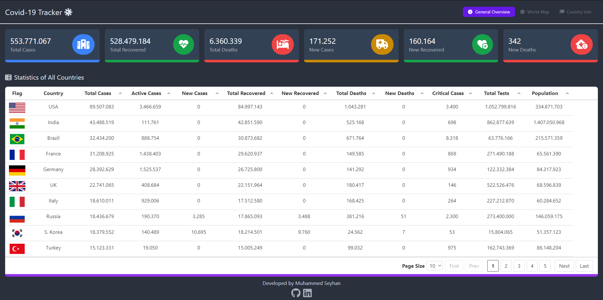
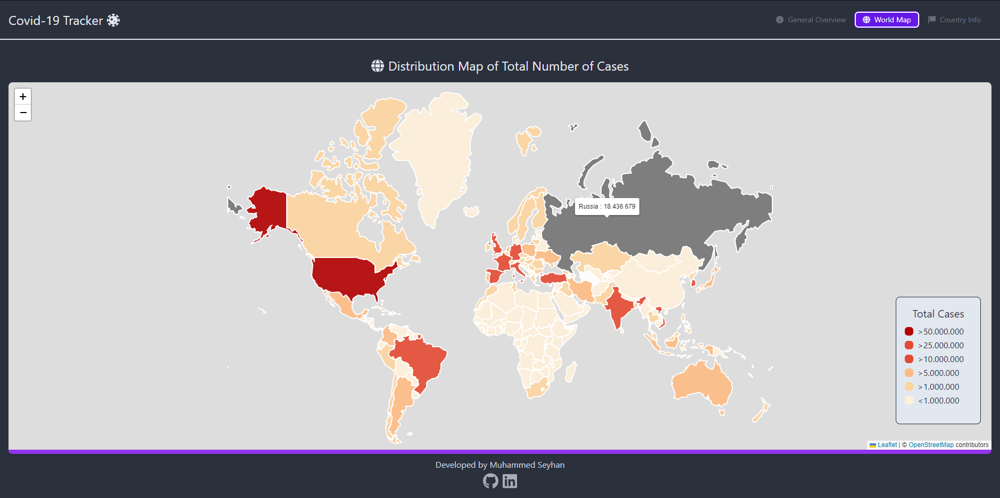
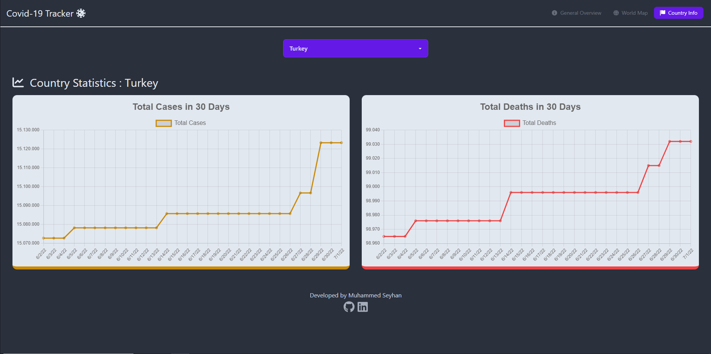

<h1 align="center">React-Redux Covid-19 Dashboard</h1>

A Covid-19 Dashboard is built with React and Redux.

<h3 align="center"><a href="https://react-redux-covid19-dashboard.netlify.app" target="_blank" rel="noreferrer noopener">See Demo Here</a></h3>
 

</img>
</img>

 

 

 

 

## Built with

-   [React Js](https://reactjs.org)
-   [Redux](https://redux-toolkit.js.org)
-   [React-Router](https://reactrouter.com)
-   [Tailwind CSS](https://tailwindcss.com)
-   [Daisy UI](https://daisyui.com)
-   [React-Leaflet](https://react-leaflet.js.org)
-   [Font Awesome](https://fontawesome.com)
-   [React Count-Up](https://www.npmjs.com/package/react-countup)
-   [Tabulator](http://tabulator.info)
-   [axios](https://www.npmjs.com/package/axios/)
-   [Source Data - Disease.sh](https://disease.sh/docs/#/)

## Contact

-   [Linkedin](https://www.linkedin.com/in/muhammedseyhann/)
